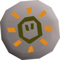
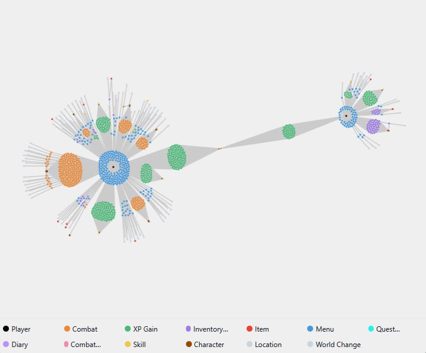
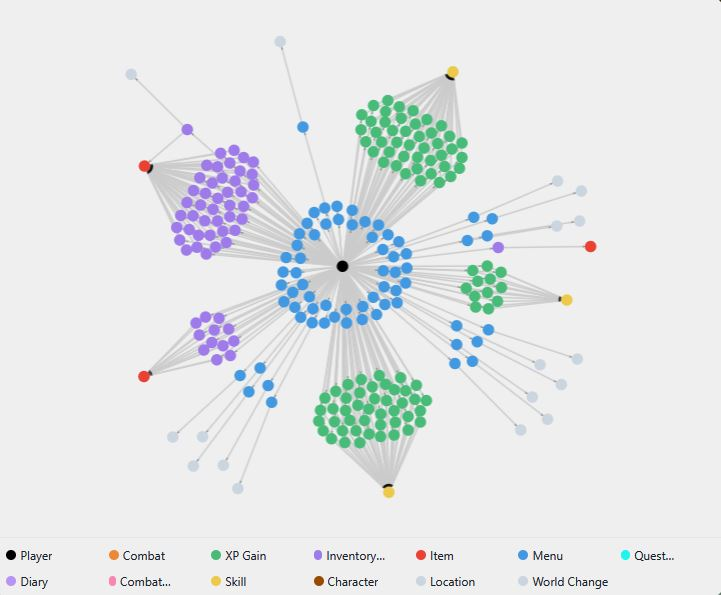

  

# MindRune Plugin

A lightweight gameplay tracker which builds a graph database and rewards player contributions to enable mindrune.xyz to provide tailored features to players based on their player graph.

MindRune does not capture any emails, passwords, IPs, or chat logs.

Visit mindrune.xyz to learn more about MindRune.

# How to Register

- Visit https://mindrune.xyz
- Connect with your desired web3 wallet and agree to terms of use.
- Navigate to your account and copy your registration key

Note: Web3 sign in allows for authentication without trusting MindRune with your email or password. It is your responsibility to keep your wallet safe.

# How to install

- Download RuneLite from their website: https://runelite.net
- Launch RuneLite
- Click the Wrench icon on the top right of the RuneLite window
- Click the Plugin-Hub button on the right side near the top
- Search for "MindRune"
- Click Install
- Configure your MindRune Registration key found at mindrune.xyz to your MindRune plugin.

You are now contributing to MindRune!

# Account

Visit mindrune.xyz/account to watch your account graph grow. As more data is collected, new connections are made, revealing unseen information!

# Scoreboard

Visit mindrune.xyz/scoreboard to see where you rank among other MindRune contributors!

# Claim

A TBD claiming portal to reward MindRune contributors based on their score.

# Forge

A TBD interface to combine memories into unique digital collectibles.

# Links

[Discord](https://discord.gg/74S5vRkNP7) - Our Discord server.

🔌 [MindRune](https://github.com/MineRune/mindrune-plugin) - The plugin's source code.
